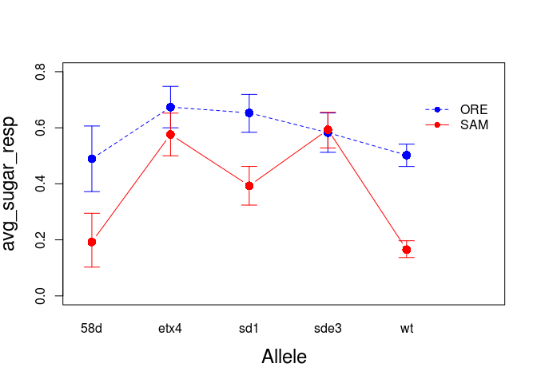
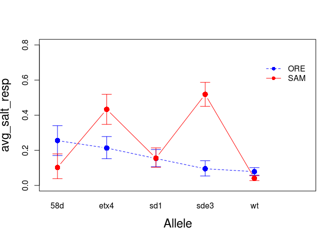
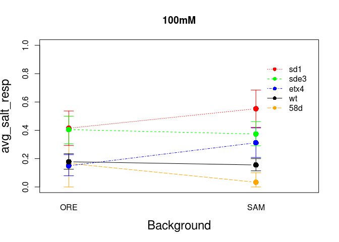
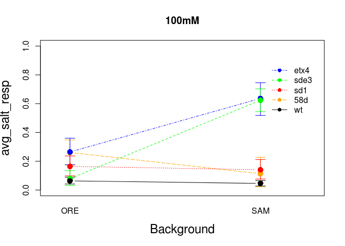
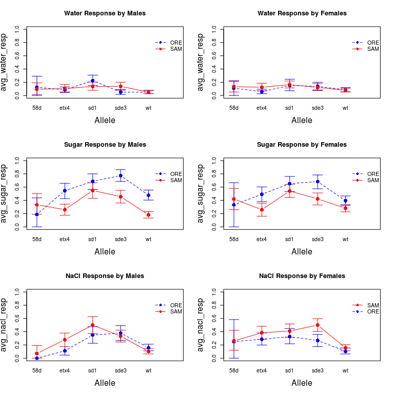
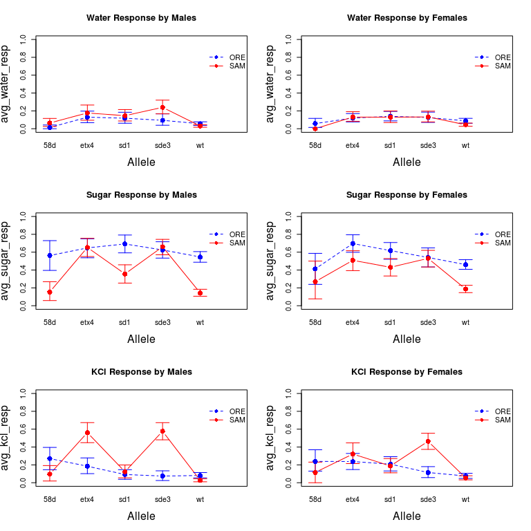

*D.melanogaster* PERA Exploratory Data Analysis
================
Megan Fritz
December 19, 2017

Loading in data sets and libraries.
===================================

``` r
#use this to specify the path to your data file

setwd("~/Dropbox/Megan/Drosophila_work") 

#Loading data sets
NaCl_data <- read.table("./Data/pera/PERA_NaCl_edited.txt", header = T)
NaCl_data <- data.frame(NaCl_data)

KCl_data <- read.table("./Data/pera/PERA_KCl.txt", header = T)
KCl_data <- data.frame(KCl_data)

#loading libraries
library(sciplot)
```

Adding barometric pressure data
-------------------------------

Because changes in barometric pressure are known to modulate insect behavioral responses (see Ankney 1984, Pellegrino et al. 2013), we explored the potential it had to influence gustation responses of *D. melanogaster* in our assays. These data were obtained from the weather underground historical data archive (<http://www.wunderground.com/history>) for Lansing, MI.

``` r
NaCl_barom <- read.table("./Data/pera/NaCl_barom_readings.txt", header = T)
NaCl_barom$delta_pres <- (NaCl_barom$pressure_6am - NaCl_barom$pressure_9am)

KCl_barom <- read.table("./Data/pera/KCl_barom_readings.txt", header = T)
KCl_barom$delta_pres <- (KCl_barom$pressure_6am - KCl_barom$pressure_9am)

#merging barometric pressure into data sets.
NaCl_data_pres <- merge(NaCl_data, NaCl_barom, by="date_test")
KCl_data_pres <- merge(KCl_data, KCl_barom, by="date_test")
```

Calculating average per fly responses
-------------------------------------

Our goal was to examine whether gustation responses were influenced by genetic background, *scalloped* (*sd*) allele, sex, etc. We first visualized these relationships by plotting average fly responses to each tastant (water, sugar, salt) by each of these factors. We first had to generate these average responses per fly for each of two experiments targeting the labellar sensilla - one where the aversive salt tastant was NaCl and another where the salt was KCl.

``` r
#Getting average response per fly to each stimulus
#NaCl
NaCl_data_pres[24:25, "avg_h2o"] <- NA
NaCl_data_pres[25:26, "avg_sugar"] <- NA
NaCl_data_pres[26:27, "avg_salt"] <- NA

NaCl_data_pres <- transform(NaCl_data_pres, avg_h2o = rowMeans(NaCl_data_pres[, c(7, 10, 13)], na.rm = TRUE))
NaCl_data_pres <- transform(NaCl_data_pres, avg_sugar = rowMeans(NaCl_data_pres[, c(8,11)], na.rm = TRUE))
NaCl_data_pres <- transform(NaCl_data_pres, avg_salt = rowMeans(NaCl_data_pres[, c(9,12)], na.rm = TRUE))

#KCl
KCl_data_pres[24:25, "avg_h2o"] <- NA
KCl_data_pres[25:26, "avg_sugar"] <- NA
KCl_data_pres[26:27, "avg_salt"] <- NA

KCl_data_pres <- transform(KCl_data_pres, avg_h2o = rowMeans(KCl_data_pres[, c(7, 10, 13)], na.rm = TRUE))
KCl_data_pres <- transform(KCl_data_pres, avg_sugar = rowMeans(KCl_data_pres[, c(8,11)], na.rm = TRUE))
KCl_data_pres <- transform(KCl_data_pres, avg_salt = rowMeans(KCl_data_pres[, c(9,12)], na.rm = TRUE))


###First looking at avg responses by individuals tested using labellar receptors
probos_N <- subset(NaCl_data_pres, receptor == "prob")  
probos_K <- subset(KCl_data_pres, receptor == "prob")
```

Visualizing the effects of pressure changes on response rates
-------------------------------------------------------------

We started by looking at how these average responses to each tastant were impacted by changes in barometric pressure by plotting response against delta\_pres.

``` r
#NaCl experiment first
par(mfrow=c(2,3))
plot(jitter(probos_N$avg_h2o)~jitter(probos_N$delta_pres), ylab = "avg_water", xlab = "delta BP")
plot(jitter(probos_N$avg_sugar)~jitter(probos_N$delta_pres), ylab = "avg_sugar", xlab = "delta BP")
plot(jitter(probos_N$avg_salt)~jitter(probos_N$delta_pres), ylab = "avg_nacl", xlab = "delta BP")

#KCl experiment next
plot(jitter(probos_K$avg_h2o)~jitter(probos_K$delta_pres), ylab = "avg_water", xlab = "delta BP")
plot(jitter(probos_K$avg_sugar)~jitter(probos_K$delta_pres), ylab = "avg_sugar", xlab = "delta BP")
plot(jitter(probos_K$avg_salt)~jitter(probos_K$delta_pres), ylab = "avg_sugar", xlab = "delta BP")
```


If any trend existed in these plots, it was that large changes in barometric pressure potentially led to slightly lower response rates overall - to any tastant.

Plotting average per fly responses
----------------------------------

Then I applied a mean and custom bootstrapped CI function to my dataset to calculate and plot average per fly response to each tastant (water, sugar, then salt) when applied to the labellar sensilla. Note that the plots allow us to visualize whether there is an interaction between allele and genetic background. Responses to each tastant are plotted separately for NaCl and KCl experiments.

**Note** that in a few of the plots I get the following error: "zero-length arrow is of indeterminate angle and so skipped". This indicates that a CI is too small to be plotted in our figure, always with *sd*<sup>58d</sup> populations. These small CIs are likely due to the combination of smaller *sd*<sup>58d</sup> sample sizes, and a lack of variation in responses by individuals to some tastants.

Mean water response rates (2.5, 97.5% CIs)
------------------------------------------

``` r
#writing bootstrapped 95% CI function
boot.fn <- function(x, N=5000) {
  Int.1 <- replicate(N, mean(sample(x, size= length(x), replace=T)))
  Int.CI <- quantile(Int.1, probs=c(0.025,0.975))
  Int.CI
}

#printing overall means and CIs
mean.avg_h2o.NaCl <- tapply(probos_N$avg_h2o, probos_N$Allele, mean)
CI.avg_h2o.NaCl <- tapply(probos_N$avg_h2o, probos_N$Allele, boot.fn)
mean.avg_h2o.NaCl
```

    ##        58d       etx4        sd1       sde3         wt 
    ## 0.11666667 0.09251101 0.16666667 0.11484099 0.06666667

``` r
CI.avg_h2o.NaCl
```

    ## $`58d`
    ##       2.5%      97.5% 
    ## 0.06666667 0.17222222 
    ## 
    ## $etx4
    ##       2.5%      97.5% 
    ## 0.06901615 0.11747430 
    ## 
    ## $sd1
    ##      2.5%     97.5% 
    ## 0.1313131 0.2020202 
    ## 
    ## $sde3
    ##       2.5%      97.5% 
    ## 0.08951708 0.14310954 
    ## 
    ## $wt
    ##       2.5%      97.5% 
    ## 0.05361111 0.08055556

``` r
#Plot to view interactions between background and allele for water responses in NaCl assay
lineplot.CI(Allele, avg_h2o, group = Background, data = probos_N, cex = 1.5, xlab = "Allele", 
                     ylab = "avg_h2o_resp", ylim = c(0, 0.3), cex.lab = 1.5, 
                     col = c("blue",  "red"), 
                     pch = c(16,16,16,16,16),
                     ci.fun= boot.fn)
```


``` r
#printing overall means and CIs
mean.avg_h2o.KCl <- tapply(probos_K$avg_h2o, probos_K$Allele, mean)
CI.avg_h2o.KCl <- tapply(probos_K$avg_h2o, probos_K$Allele, boot.fn)
mean.avg_h2o.KCl
```

    ##        58d       etx4        sd1       sde3         wt 
    ## 0.03875969 0.13787879 0.13356974 0.15248227 0.05366922

``` r
CI.avg_h2o.KCl
```

    ## $`58d`
    ##       2.5%      97.5% 
    ## 0.01550388 0.06201550 
    ## 
    ## $etx4
    ##      2.5%     97.5% 
    ## 0.1075758 0.1712121 
    ## 
    ## $sd1
    ##      2.5%     97.5% 
    ## 0.1040189 0.1678487 
    ## 
    ## $sde3
    ##      2.5%     97.5% 
    ## 0.1193853 0.1867612 
    ## 
    ## $wt
    ##       2.5%      97.5% 
    ## 0.04417671 0.06425703

``` r
#Plot to view interactions between background and allele for water responses in KCl assay
lineplot.CI(Allele, avg_h2o, group = Background, data = probos_K, cex = 1.5, xlab = "Allele", 
                     ylab = "avg_h2o_resp", ylim = c(0, 0.3), cex.lab = 1.5, 
                     col = c("blue", "red"), pch = c(16,16,16,16),
                     ci.fun= boot.fn)
```


Mean sugar response rates (2.5, 97.5% CIs)
------------------------------------------

``` r
#printing overall means and CIs
mean.avg_sug.NaCl <- tapply(probos_N$avg_sugar, probos_N$Allele, mean)
CI.avg_sug.NaCl <- tapply(probos_N$avg_sugar, probos_N$Allele, boot.fn)
mean.avg_sug.NaCl
```

    ##       58d      etx4       sd1      sde3        wt 
    ## 0.3500000 0.3920705 0.5984848 0.5636042 0.3241667

``` r
CI.avg_sug.NaCl
```

    ## $`58d`
    ##  2.5% 97.5% 
    ##  0.25  0.45 
    ## 
    ## $etx4
    ##      2.5%     97.5% 
    ## 0.3392070 0.4493392 
    ## 
    ## $sd1
    ##      2.5%     97.5% 
    ## 0.5429293 0.6540404 
    ## 
    ## $sde3
    ##      2.5%     97.5% 
    ## 0.5123675 0.6130742 
    ## 
    ## $wt
    ##      2.5%     97.5% 
    ## 0.2916667 0.3566667

``` r
#Plot to view interactions between background and allele for sugar responses in NaCl assay
lineplot.CI(Allele, avg_sugar, group = Background, data = probos_N, cex = 1.5, xlab = "Allele", 
                     ylab = "avg_sugar_resp", ylim = c(0, 0.8), cex.lab = 1.5, 
                     col = c("blue",  "red"), 
                     pch = c(16,16,16,16,16),
                     ci.fun= boot.fn)
```


``` r
#printing overall means and CIs
mean.avg_sug.KCl <- tapply(probos_K$avg_sugar, probos_K$Allele, mean)
CI.avg_sug.KCl <- tapply(probos_K$avg_sugar, probos_K$Allele, boot.fn)
mean.avg_sug.KCl
```

    ##       58d      etx4       sd1      sde3        wt 
    ## 0.3546512 0.6272727 0.5195035 0.5886525 0.3203724

``` r
CI.avg_sug.KCl
```

    ## $`58d`
    ##      2.5%     97.5% 
    ## 0.2674419 0.4418605 
    ## 
    ## $etx4
    ##      2.5%     97.5% 
    ## 0.5727273 0.6818182 
    ## 
    ## $sd1
    ##      2.5%     97.5% 
    ## 0.4698582 0.5691489 
    ## 
    ## $sde3
    ##      2.5%     97.5% 
    ## 0.5407801 0.6365248 
    ## 
    ## $wt
    ##      2.5%     97.5% 
    ## 0.2946331 0.3488499

``` r
#Plot to view interactions between background and allele for sugar responses in KCl assay
lineplot.CI(Allele, avg_sugar, group = Background, data = probos_K, cex = 1.5, xlab = "Allele", 
                     ylab = "avg_sugar_resp", ylim = c(0, 0.8), cex.lab = 1.5, 
                     col = c("blue", "red"), pch = c(16,16,16,16),
                     ci.fun= boot.fn)
```



Mean salt response rates (2.5, 97.5% CIs)
-----------------------------------------

``` r
#printing overall means and CIs
mean.avg_salt.NaCl <- tapply(probos_N$avg_salt, probos_N$Allele, mean)
CI.avg_salt.NaCl <- tapply(probos_N$avg_salt, probos_N$Allele, boot.fn)
mean.avg_salt.NaCl
```

    ##       58d      etx4       sd1      sde3        wt 
    ## 0.1583333 0.2665198 0.4015152 0.3780919 0.1308333

``` r
CI.avg_salt.NaCl
```

    ## $`58d`
    ##       2.5%      97.5% 
    ## 0.08333333 0.24166667 
    ## 
    ## $etx4
    ##      2.5%     97.5% 
    ## 0.2180617 0.3149780 
    ## 
    ## $sd1
    ##      2.5%     97.5% 
    ## 0.3434343 0.4621212 
    ## 
    ## $sde3
    ##      2.5%     97.5% 
    ## 0.3286219 0.4293286 
    ## 
    ## $wt
    ##      2.5%     97.5% 
    ## 0.1083333 0.1550000

``` r
#Plot to view interactions between background and allele for salt responses in NaCl assay
lineplot.CI(Allele, avg_salt, group = Background, data = probos_N, cex = 1.5, xlab = "Allele", 
                     ylab = "avg_salt_resp", ylim = c(0, 0.8), cex.lab = 1.5, 
                     col = c("blue",  "red"), 
                     pch = c(16,16,16,16,16),
                     ci.fun= boot.fn)
```


``` r
#printing overall means and CIs
mean.avg_salt.KCl <- tapply(probos_K$avg_salt, probos_K$Allele, mean)
CI.avg_salt.KCl <- tapply(probos_K$avg_salt, probos_K$Allele, boot.fn)
mean.avg_salt.KCl
```

    ##        58d       etx4        sd1       sde3         wt 
    ## 0.18604651 0.31818182 0.15425532 0.33687943 0.05805038

``` r
CI.avg_salt.KCl
```

    ## $`58d`
    ##     2.5%    97.5% 
    ## 0.127907 0.250000 
    ## 
    ## $etx4
    ##      2.5%     97.5% 
    ## 0.2636364 0.3727273 
    ## 
    ## $sd1
    ##      2.5%     97.5% 
    ## 0.1187943 0.1914894 
    ## 
    ## $sde3
    ##      2.5%     97.5% 
    ## 0.2890071 0.3865248 
    ## 
    ## $wt
    ##       2.5%      97.5% 
    ## 0.04654984 0.07064622

``` r
#Plot to view interactions between background and allele for salt responses in KCl assay
lineplot.CI(Allele, avg_salt, group = Background, data = probos_K, cex = 1.5, xlab = "Allele", 
                     ylab = "avg_salt_resp", ylim = c(0, 0.8), cex.lab = 1.5, 
                     col = c("blue", "red"), pch = c(16,16,16,16),
                     ci.fun= boot.fn)
```



This final plot, in particular suggested that responses to KCl were higher for individuals bearing the *sd*<sup>e3</sup> and *sd*<sup>etx4</sup> alleles in the SAM background relative to SAM wild-type (wt). More interestingly, KCl responses were not elevated in individuals bearing the *sd*<sup>e3</sup> and *sd*<sup>etx4</sup> alleles in the ORE background relative to the ORE wt.

Effects of salt concentration on salt response rate.
----------------------------------------------------

For each of the two experiments where NaCl and KCl was applied to the labellar sensilla, we used two different salt concentrations - 100mM and 500mM for each salt. Here we plotted the effects of these salt concentrations, first for NaCl and then KCl response rates.

NaCl response rates for each concentration
------------------------------------------

``` r
#subsetting by NaCl concentration, and plotting salt response means (+/-95% CIs) for each subset.
NaCl100 <- subset(probos_N, salt_conc == 100)
NaCl500 <- subset(probos_N, salt_conc == 500)

#plotting salt responses
lineplot.CI(Background, avg_salt, group = Allele, data = NaCl100, cex = 1.5, xlab = "Background", 
            ylab = "avg_salt_resp", ylim = c(0, 1), cex.lab = 1.5, 
            col = c("orange", "blue",  "red", "green", "black"), pch = c(16,16,16,16,16), main = "100mM",
            ci.fun= boot.fn)
```



``` r
lineplot.CI(Background, avg_salt, group = Allele, data = NaCl500, cex = 1.5, xlab = "Background", 
            ylab = "avg_salt_resp", ylim = c(0, 1), cex.lab = 1.5, 
            col = c("orange", "blue",  "red", "green", "black"), pch = c(16,16,16,16,16), main = "500mM",
            ci.fun= boot.fn)
```


In this second plot, when NaCl concentrations were higher, individuals bearing the *sd*<sup>e3</sup> allele were more likely to respond if they had a SAM genetic background relative to those with the ORE genetic background. This effect was really only seen at the higher concentration of NaCl.

KCl response rates for each concentration
-----------------------------------------

``` r
KCl100 <- subset(probos_K, salt_conc == 100)
KCl500 <- subset(probos_K, salt_conc == 500)

lineplot.CI(Background, avg_salt, group = Allele, data = KCl100, cex = 1.5, xlab = "Background", 
            ylab = "avg_salt_resp", ylim = c(0, 1), cex.lab = 1.5, 
            col = c("orange", "blue",  "red", "green", "black"), pch = c(16,16,16,16,16),
            main = "100mM",
            ci.fun= boot.fn)
```



``` r
lineplot.CI(Background, avg_salt, group = Allele, data = KCl500, cex = 1.5, xlab = "Background", 
            ylab = "avg_salt_resp", ylim = c(0, 1), cex.lab = 1.5, 
            col = c("orange", "blue",  "red", "green", "black"), pch = c(16,16,16,16,16),
            main = "500mM",
            ci.fun= boot.fn)
```

    ## Warning in arrows(leg.vals$xvals[CI.seln], CI.plot[, 1], leg.vals
    ## $xvals[CI.seln], : zero-length arrow is of indeterminate angle and so
    ## skipped


When KCl was used as the aversive tastant, individuals bearing the *sd*<sup>e3</sup> and *sd*<sup>etx4</sup> allele were most likely to respond if they had a SAM genetic background, and this effect was most apparent at lower concentrations of KCl.

Differences between male and female responses
---------------------------------------------

We also visualized whether there were any differences in response rates by males and virgin females. Given that sex-specific differences exist for a multitude of *D. melanogaster* behavioral traits, we expected these differences would manifest themselves not only for the salt treatments, but the sugar and water treatments as well. Responses to each tastant are plotted below.

``` r
#NaCl plots first
NaCl_m <- subset(probos_N, Sex == "m")
NaCl_f <- subset(probos_N, Sex == "f")

par(mfrow = c(3,2))
lineplot.CI(Allele, avg_h2o, group = Background, data = NaCl_m, cex = 1.5, xlab = "Allele", 
            ylab = "avg_water_resp", ylim = c(0, 1), cex.lab = 1.5, 
            col = c("blue",  "red"), pch = c(16,16,16,16,16),
            main = "Water Response by Males",
            ci.fun= boot.fn)

lineplot.CI(Allele, avg_h2o, group = Background, data = NaCl_f, cex = 1.5, xlab = "Allele", 
            ylab = "avg_water_resp", ylim = c(0, 1), cex.lab = 1.5, 
            col = c("blue",  "red"), pch = c(16,16,16,16,16),
            main = "Water Response by Females",
            ci.fun= boot.fn)

lineplot.CI(Allele, avg_sugar, group = Background, data = NaCl_m, cex = 1.5, xlab = "Allele", 
            ylab = "avg_sugar_resp", ylim = c(0, 1), cex.lab = 1.5, 
            col = c("blue",  "red"), pch = c(16,16,16,16,16),
            main = "Sugar Response by Males",
            ci.fun= boot.fn)

lineplot.CI(Allele, avg_sugar, group = Background, data = NaCl_f, cex = 1.5, xlab = "Allele", 
            ylab = "avg_sugar_resp", ylim = c(0, 1), cex.lab = 1.5, 
            col = c("blue",  "red"), pch = c(16,16,16,16,16),
            main = "Sugar Response by Females",
            ci.fun= boot.fn)

lineplot.CI(Allele, avg_salt, group = Background, data = NaCl_m, cex = 1.5, xlab = "Allele", 
            ylab = "avg_nacl_resp", ylim = c(0, 1), cex.lab = 1.5, 
            col = c("blue",  "red"), pch = c(16,16,16,16,16),
            main = "NaCl Response by Males",
            ci.fun= boot.fn)
```

    ## Warning in arrows(leg.vals$xvals[CI.seln], CI.plot[, 1], leg.vals
    ## $xvals[CI.seln], : zero-length arrow is of indeterminate angle and so
    ## skipped

``` r
lineplot.CI(Allele, avg_salt, group = Background, data = NaCl_f, cex = 1.5, xlab = "Allele", 
            ylab = "avg_nacl_resp", ylim = c(0, 1), cex.lab = 1.5, 
            col = c("blue",  "red"), pch = c(16,16,16,16,16),
            main = "NaCl Response by Females",
            ci.fun= boot.fn)
```



``` r
#KCl plots next
KCl_m <- subset(probos_K, Sex == "m")
KCl_f <- subset(probos_K, Sex == "f")

par(mfrow = c(3,2))
lineplot.CI(Allele, avg_h2o, group = Background, data = KCl_m, cex = 1.5, xlab = "Allele", 
            ylab = "avg_water_resp", ylim = c(0, 1), cex.lab = 1.5, 
            col = c("blue",  "red"), pch = c(16,16,16,16,16),
            main = "Water Response by Males",
            ci.fun= boot.fn)

lineplot.CI(Allele, avg_h2o, group = Background, data = KCl_f, cex = 1.5, xlab = "Allele", 
            ylab = "avg_water_resp", ylim = c(0, 1), cex.lab = 1.5, 
            col = c("blue",  "red"), pch = c(16,16,16,16,16),
            main = "Water Response by Females",
            ci.fun= boot.fn)
```

    ## Warning in arrows(leg.vals$xvals[CI.seln], CI.plot[, 1], leg.vals
    ## $xvals[CI.seln], : zero-length arrow is of indeterminate angle and so
    ## skipped

``` r
lineplot.CI(Allele, avg_sugar, group = Background, data = KCl_m, cex = 1.5, xlab = "Allele", 
            ylab = "avg_sugar_resp", ylim = c(0, 1), cex.lab = 1.5, 
            col = c("blue",  "red"), pch = c(16,16,16,16,16),
            main = "Sugar Response by Males",
            ci.fun= boot.fn)

lineplot.CI(Allele, avg_sugar, group = Background, data = KCl_f, cex = 1.5, xlab = "Allele", 
            ylab = "avg_sugar_resp", ylim = c(0, 1), cex.lab = 1.5, 
            col = c("blue",  "red"), pch = c(16,16,16,16,16),
            main = "Sugar Response by Females",
            ci.fun= boot.fn)

lineplot.CI(Allele, avg_salt, group = Background, data = KCl_m, cex = 1.5, xlab = "Allele", 
            ylab = "avg_kcl_resp", ylim = c(0, 1), cex.lab = 1.5, 
            col = c("blue",  "red"), pch = c(16,16,16,16,16),
            main = "KCl Response by Males",
            ci.fun= boot.fn)

lineplot.CI(Allele, avg_salt, group = Background, data = KCl_f, cex = 1.5, xlab = "Allele", 
            ylab = "avg_kcl_resp", ylim = c(0, 1), cex.lab = 1.5, 
            col = c("blue",  "red"), pch = c(16,16,16,16,16),
            main = "KCl Response by Females",
            ci.fun= boot.fn)
```



Tarsal responses to water, sugar and NaCl
-----------------------------------------

We also collected data on the proboscis extension responses of *D. melanogaster* when the same tastants were applied to their tarsi. Response data were only collected in a single experiment where the aversive tastant was NaCl. For the sake of comparison, I have plotted them next to the responses from the experiment where NaCl was applied to the labellum.

``` r
#subsetting for tarsal data
tars_N <- subset(NaCl_data_pres, receptor == "tars")  

par(mfrow=c(3,2))

lineplot.CI(Allele, avg_h2o, group = Background, data = tars_N, cex = 1.5, xlab = "Allele", 
                     ylab = "avg_h2o_resp", ylim = c(0, 0.3), cex.lab = 1.5, 
                     col = c("blue",  "red"), main = "Tarsal Responses to Water",
                     pch = c(16,16,16,16,16),
                     ci.fun= boot.fn)
```

    ## Warning in arrows(leg.vals$xvals[CI.seln], CI.plot[, 1], leg.vals
    ## $xvals[CI.seln], : zero-length arrow is of indeterminate angle and so
    ## skipped

``` r
lineplot.CI(Allele, avg_h2o, group = Background, data = probos_N, cex = 1.5, xlab = "Allele", 
                     ylab = "avg_h2o_resp", ylim = c(0, 0.3), cex.lab = 1.5, 
                     col = c("blue",  "red"), 
                     pch = c(16,16,16,16,16), main = "Labellar Responses to Water",
                     ci.fun= boot.fn)

lineplot.CI(Allele, avg_sugar, group = Background, data = tars_N, cex = 1.5, xlab = "Allele", 
                     ylab = "avg_sugar_resp", ylim = c(0, 1), cex.lab = 1.5, 
                     col = c("blue",  "red"), main = "Tarsal Responses to Sugar",
                     pch = c(16,16,16,16,16),
                     ci.fun= boot.fn)

lineplot.CI(Allele, avg_sugar, group = Background, data = probos_N, cex = 1.5, xlab = "Allele", 
                     ylab = "avg_sugar_resp", ylim = c(0, 1), cex.lab = 1.5, 
                     col = c("blue",  "red"), main = "Labellar Responses to Sugar",
                     pch = c(16,16,16,16,16),
                     ci.fun= boot.fn)

lineplot.CI(Allele, avg_h2o, group = Background, data = tars_N, cex = 1.5, xlab = "Allele", 
                     ylab = "avg_NaCl_resp", ylim = c(0, 0.3), cex.lab = 1.5, 
                     col = c("blue",  "red"), main = "Tarsal Responses to NaCl",
                     pch = c(16,16,16,16,16),
                     ci.fun= boot.fn)
```

    ## Warning in arrows(leg.vals$xvals[CI.seln], CI.plot[, 1], leg.vals
    ## $xvals[CI.seln], : zero-length arrow is of indeterminate angle and so
    ## skipped

``` r
lineplot.CI(Allele, avg_h2o, group = Background, data = probos_N, cex = 1.5, xlab = "Allele", 
                     ylab = "avg_NaCl_resp", ylim = c(0, 0.3), cex.lab = 1.5, 
                     col = c("blue",  "red"), main = "Labellar Responses to NaCl",
                     pch = c(16,16,16,16,16),
                     ci.fun= boot.fn)
```


These plots indicate that: 1) responses to all tastants were generally lower when tastants were applied to the tarsi, and 2) allelic trends seen in the responses by the labellar sensilla are not similar to those seen from tarsal sensilla.
