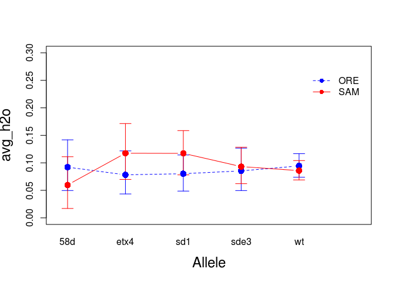

PERA\_Exploratory\_Data\_Analysis
================
Megan Fritz
December 19, 2017

Start by loading in data sets and libraries.

``` r
#use this to specify the path to your data file

setwd("~/Dropbox/Megan/Drosophila_work") 

#Loading data sets
NaCl_data <- read.table("./Data/pera/PERA_NaCl_edited.txt", header = T)
NaCl_data <- data.frame(NaCl_data)

KCl_data <- read.table("./Data/pera/PERA_KCl.txt", header = T)
KCl_data <- data.frame(KCl_data)

#loading libraries
library(sciplot)
```

Because changes in barometric pressure are known to modulate insect behavioral responses (see Ankney 1984, Pellegrino et al. 2013), we explored the potential it had to influence gustation responses in our assays.

``` r
NaCl_barom <- read.table("./Data/pera/NaCl_barom_readings.txt", header = T)
NaCl_barom$delta_pres <- (NaCl_barom$pressure_6am - NaCl_barom$pressure_9am)

KCl_barom <- read.table("./Data/pera/KCl_barom_readings.txt", header = T)
KCl_barom$delta_pres <- (KCl_barom$pressure_6am - KCl_barom$pressure_9am)

#merging barometric pressure into data sets.
NaCl_data_pres <- merge(NaCl_data, NaCl_barom, by="date_test")
KCl_data_pres <- merge(KCl_data, KCl_barom, by="date_test")
```

Our goal was to examine whether gustation responses were influenced by genetic background, scalloped allele, sex, etc. We first visualized these relationships by plotting average fly responses to each tastant (water, sugar, salt) by each of these factors.

``` r
#Getting average response per fly to each stimulus
#NaCl
NaCl_data_pres[24:25, "avg_h2o"] <- NA
NaCl_data_pres[25:26, "avg_sugar"] <- NA
NaCl_data_pres[26:27, "avg_salt"] <- NA

NaCl_data_pres <- transform(NaCl_data_pres, avg_h2o = rowMeans(NaCl_data[, c(7, 10, 13)], na.rm = TRUE))
NaCl_data_pres <- transform(NaCl_data_pres, avg_sugar = rowMeans(NaCl_data[, c(8,11)], na.rm = TRUE))
NaCl_data_pres <- transform(NaCl_data_pres, avg_salt = rowMeans(NaCl_data[, c(9,12)], na.rm = TRUE))

#KCl
KCl_data_pres[24:25, "avg_h2o"] <- NA
KCl_data_pres[25:26, "avg_sugar"] <- NA
KCl_data_pres[26:27, "avg_salt"] <- NA

KCl_data_pres <- transform(KCl_data_pres, avg_h2o = rowMeans(KCl_data[, c(7, 10, 13)], na.rm = TRUE))
KCl_data_pres <- transform(KCl_data_pres, avg_sugar = rowMeans(KCl_data[, c(8,11)], na.rm = TRUE))
KCl_data_pres <- transform(KCl_data_pres, avg_salt = rowMeans(KCl_data[, c(9,12)], na.rm = TRUE))


###First looking at avg responses by individuals tested using labellar receptors
probos_N <- subset(NaCl_data_pres, receptor == "prob")  
probos_K <- subset(KCl_data_pres, receptor == "prob")
```

Here I generated a custom bootstrap function that can be used in our plot of average responses to each tastant: water, sugar, and salt.

``` r
#writing bootstrapped 95% CI function
boot.fn <- function(x, N=5000) {
  Int.1 <- replicate(N, mean(sample(x, size= length(x), replace=T)))
  Int.CI <- quantile(Int.1, probs=c(0.025,0.975))
  Int.CI
}
```

Then I applied the mean and bootstrap functions to my dataset to calculate and plot average per fly response to water when applied to the labellar sensilla. Note that the plots allow us to visualize whether there is an interaction between allele and genetic background. Responses to water are plotted separately for each of two experiments - one where the aversive tastant was NaCl and another where the aversive tastant was KCl.

``` r
#printing overall means and CIs
mean.avg_h2o.NaCl <- tapply(probos_N$avg_h2o, probos_N$Allele, mean)
CI.avg_h2o.NaCl <- tapply(probos_N$avg_h2o, probos_N$Allele, boot.fn)
mean.avg_h2o.NaCl
```

    ##        58d       etx4        sd1       sde3         wt 
    ## 0.06666667 0.07342144 0.06565657 0.08303887 0.07166667

``` r
CI.avg_h2o.NaCl
```

    ## $`58d`
    ##       2.5%      97.5% 
    ## 0.02777778 0.11111111 
    ## 
    ## $etx4
    ##       2.5%      97.5% 
    ## 0.05139501 0.09838473 
    ## 
    ## $sd1
    ##       2.5%      97.5% 
    ## 0.04377104 0.08922559 
    ## 
    ## $sde3
    ##       2.5%      97.5% 
    ## 0.05946702 0.10777385 
    ## 
    ## $wt
    ##       2.5%      97.5% 
    ## 0.05777778 0.08666667

``` r
#Plot to view interactions between background and allele for water responses in NaCl assay
lineplot.CI(Allele, avg_h2o, group = Background, data = probos_N, cex = 1.5, xlab = "Allele", 
                     ylab = "avg_h2o", ylim = c(0, 0.3), cex.lab = 1.5, 
                     col = c("blue",  "red"), 
                     pch = c(16,16,16,16,16),
                     ci.fun= boot.fn)
```


``` r
#printing overall means and CIs
mean.avg_h2o.KCl <- tapply(probos_K$avg_h2o, probos_K$Allele, mean)
CI.avg_h2o.KCl <- tapply(probos_K$avg_h2o, probos_K$Allele, boot.fn)
mean.avg_h2o.KCl
```

    ##        58d       etx4        sd1       sde3         wt 
    ## 0.07751938 0.09696970 0.09929078 0.08983452 0.08981380

``` r
CI.avg_h2o.KCl
```

    ## $`58d`
    ##       2.5%      97.5% 
    ## 0.04651163 0.11240310 
    ## 
    ## $etx4
    ##       2.5%      97.5% 
    ## 0.06666667 0.13030303 
    ## 
    ## $sd1
    ##       2.5%      97.5% 
    ## 0.07328605 0.12647754 
    ## 
    ## $sde3
    ##       2.5%      97.5% 
    ## 0.06619385 0.11583924 
    ## 
    ## $wt
    ##       2.5%      97.5% 
    ## 0.07667032 0.10332238

``` r
#Plot to view interactions between background and allele for water responses in KCl assay
lineplot.CI(Allele, avg_h2o, group = Background, data = probos_K, cex = 1.5, xlab = "Allele", 
                     ylab = "avg_h2o", ylim = c(0, 0.3), cex.lab = 1.5, 
                     col = c("blue", "red"), pch = c(16,16,16,16),
                     ci.fun= boot.fn)
```



Note that the `echo = FALSE` parameter was added to the code chunk to prevent printing of the R code that generated the plot.
